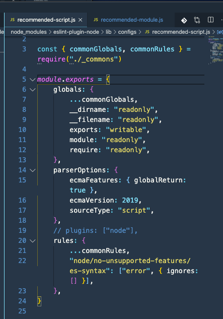
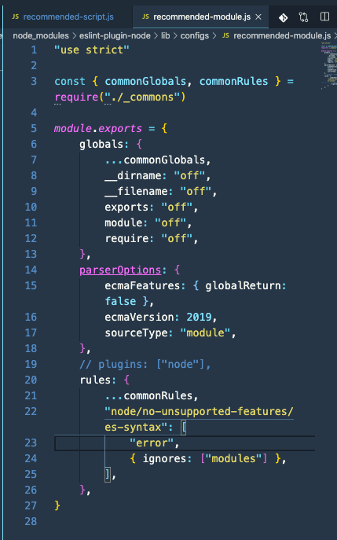

# eslint-plugin-node-config

[eslint-plugin-node](https://github.com/mysticatea/eslint-plugin-node#readme) は plugin に含まれている extends を利用するだけで動くことを試す。

lint 対象としてこのようなコードを用意する。

```javascript:title=index.js
exports = {
  foo: 1,
};
```

これは eslint-plugin-node の`plugin:node/recommended` に含まれる[node/no-exports-assign](https://github.com/mysticatea/eslint-plugin-node/blob/master/docs/rules/no-exports-assign.md)に弾かれるコードだ。

```sh
$ npx eslint index.js

  1:1  error  Unexpected assignment to 'exports' variable. Use 'module.exports' instead  node/no-exports-assign
```

rule も plugin も入れていないが、きちんと弾かれる。
なぜなら extends が拡張しているから。

その拡張部分は、

```js
// recommended-module.js

"use strict";

const { commonGlobals, commonRules } = require("./_commons");

module.exports = {
  globals: {
    ...commonGlobals,
    __dirname: "off",
    __filename: "off",
    exports: "off",
    module: "off",
    require: "off",
  },
  parserOptions: {
    ecmaFeatures: { globalReturn: false },
    ecmaVersion: 2019,
    sourceType: "module",
  },
  plugins: ["node"],
  rules: {
    ...commonRules,
    "node/no-unsupported-features/es-syntax": [
      "error",
      { ignores: ["modules"] },
    ],
  },
};
```

```js
// recommended-script.js
"use strict";

const { commonGlobals, commonRules } = require("./_commons");

module.exports = {
  globals: {
    ...commonGlobals,
    __dirname: "readonly",
    __filename: "readonly",
    exports: "writable",
    module: "readonly",
    require: "readonly",
  },
  parserOptions: {
    ecmaFeatures: { globalReturn: true },
    ecmaVersion: 2019,
    sourceType: "script",
  },
  plugins: ["node"],
  rules: {
    ...commonRules,
    "node/no-unsupported-features/es-syntax": ["error", { ignores: [] }],
  },
};
```

とある。

これらは node_modules の eslint-plugin-node に含まれている。
では実験として、**これらの plugins: ["node"]をコメントアウトしてみよう。**

こんなふうに





そして先ほどと同じように eslint コマンドを実行してみよう。

```sh
> npx eslint index.js

  1:1  error  Definition for rule 'node/no-deprecated-api' was not found                      node/no-deprecated-api
  1:1  error  Definition for rule 'node/no-extraneous-import' was not found                   node/no-extraneous-import
  1:1  error  Definition for rule 'node/no-extraneous-require' was not found                  node/no-extraneous-require
  1:1  error  Definition for rule 'node/no-exports-assign' was not found                      node/no-exports-assign
  1:1  error  Definition for rule 'node/no-missing-import' was not found                      node/no-missing-import
  1:1  error  Definition for rule 'node/no-missing-require' was not found                     node/no-missing-require
  1:1  error  Definition for rule 'node/no-unpublished-bin' was not found                     node/no-unpublished-bin
  1:1  error  Definition for rule 'node/no-unpublished-import' was not found                  node/no-unpublished-import
  1:1  error  Definition for rule 'node/no-unpublished-require' was not found                 node/no-unpublished-require
  1:1  error  Definition for rule 'node/no-unsupported-features/es-builtins' was not found    node/no-unsupported-features/es-builtins
  1:1  error  Definition for rule 'node/no-unsupported-features/es-syntax' was not found      node/no-unsupported-features/es-syntax
  1:1  error  Definition for rule 'node/no-unsupported-features/node-builtins' was not found  node/no-unsupported-features/node-builtins
  1:1  error  Definition for rule 'node/process-exit-as-throw' was not found                  node/process-exit-as-throw
  1:1  error  Definition for rule 'node/shebang' was not found
```

はい、たくさんの `Definition for rule 'node/no-deprecated-api' was not found` が出ました。
つまり plugin を経由して rule を追加しており、その plugin は extends から登録されていたと言うことです。
